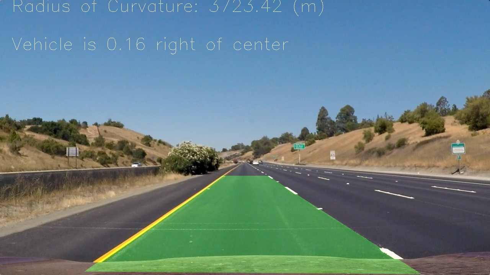

## Advanced Lane Finding

### Submission Note
** Please find `P2.ipynb` which contains code for this project. `experiments.ipynb` contains various experiments that I carried out to test different approaches.
** [Link to Output Video (project_video.mp4)](https://drive.google.com/file/d/1MiFRwjmVgJxiquISm-z501C7eNgOyrQc/view?usp=sharing)
** [Link to Output Video 2](https://drive.google.com/file/d/1JO36GXPaqSEQ_1VrrvTFmw67ISBbrJNO/view?usp=sharing)

In this project, your goal is to write a software pipeline to identify the lane boundaries in a video, but the main output or product we want you to create is a detailed writeup of the project.  Check out the [writeup template](https://github.com/udacity/CarND-Advanced-Lane-Lines/blob/master/writeup_template.md) for this project and use it as a starting point for creating your own writeup.  

## Writeup

#### 1. Briefly state how you computed the camera matrix and distortion coefficients. Provide an example of a distortion corrected calibration image.

I followed instructions given in lectures to calculate camera matrix and distortion coefficients. OpenCV provides many convenient function to calculate these numbers. I used provided Chess Board images to find these values and then used `cv2.undistort` to undistort images. I also stored parameters so that we don't have to compute them again and again.

#### 2. Provide an example of a distortion-corrected image.

#### 3. Describe how (and identify where in your code) you used color transforms, gradients or other methods to create a thresholded binary image. Provide an example of a binary image result.

Following the lecture and some trial and error, I found S channel in HLS color space most useful. Moreover, I tried with `Sobel X`, `Sobel Y`, and also `Sobel Magnitude` for gradients. I found the combination of Sobel X and Sobel Y most usuful. The code can be found in cell `55`.

#### 4. Describe how (and identify where in your code) you performed a perspective transform and provide an example of a transformed image.

For perspective transformation, we need to select source point and destination point to change the view (i.e bird eye). For this, I found both of these points through trial and error. Code for this can be found in cell `56`.

#### 5. Describe how (and identify where in your code) you identified lane-line pixels and fit their positions with a polynomial?

I used the concept of sliding window explained in lectures to identify lane pixels. First of all, I calculated histogram to find both lines. Then used sliding window (towards top of the image) and found nonzero pixels. This process conntinues until it reaches the top. Code for this can be found in cell `44`.

#### 6. Describe how (and identify where in your code) you calculated the radius of curvature of the lane and the position of the vehicle with respect to center.

I used the formula provided in the lecture to calculate radius of curvature. To find the position of the vehicle, first, I computed the middle of the lane (using both lines) and substracted `image_width/2` from it to find the position. Code for this can be found in cell `45` and `143`.

#### 7. Provide an example image of your result plotted back down onto the road such that the lane area is identified clearly.

Here is a final output image of my pipeline.

More images can be found in `output_images` directory.

## Pipeline (Video)

1 [Link to Output Video (project_video.mp4)](https://drive.google.com/file/d/1MiFRwjmVgJxiquISm-z501C7eNgOyrQc/view?usp=sharing)

## Discussion

#### 1. Briefly, discuss any problems/issues you faced in your implementation of this project. Where will your pipeline likely fail? What could you do to make it more robust?

   - Out of many phases involved in this project, lane detection required the most attention.
   - Since our pipeline involves multiple dependent phases, if one (early) stage fails then the whole pipeline might malfunction.
   - Based on my previous experince with Semantic Segmentation, a deep learning based approach for lane detection might be another feasible solution.