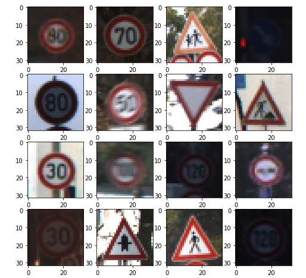
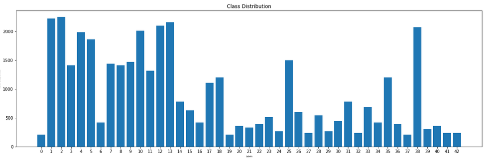
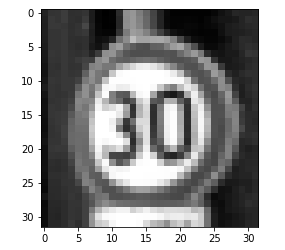
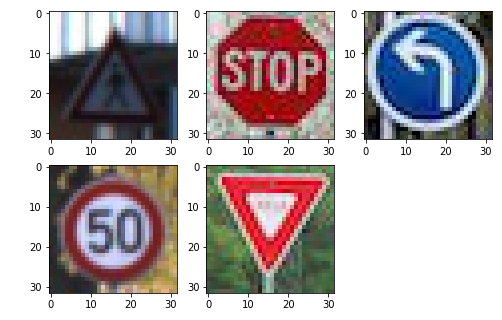

## Project: Build a Traffic Sign Recognition Program

## Submission Note: Please find `Traffic_Sign_Classifier.ipynb` and html version at `Traffic_Sign_Classifier_HTML.html`. Also, please find writeup below.

The Project
---
The goals / steps of this project are the following:
* Load the data set
* Explore, summarize and visualize the data set
* Design, train and test a model architecture
* Use the model to make predictions on new images
* Analyze the softmax probabilities of the new images
* Summarize the results with a written report

# Writeup

### Data Set Summary & Exploration

#### 1. Provide a basic summary of the data set. In the code, the analysis should be done using python, numpy and/or pandas methods rather than hardcoding results manually.

Cell no.4 in the notebook calculates basic summary of the dataset which is given below.
 - Number of training examples = 39209
 - Number of testing examples = 12630
 - Number of validation examples = 4410
 - Image data shape = (32, 32, 3)
 - Number of classes = 43

#### 2. Include an exploratory visualization of the dataset.

I used numpy and matplotlib to do the visualization. I visualized few samples image as well as bar chart to check the class imbalance. You can find them in cell no 6 and 8.
Here, training data may seem imbalanced but since test data also follows similar distribution it would not hurt our model.

### Design and Test a Model Architecture

#### 1. Describe how you preprocessed the image data. What techniques were chosen and why did you choose these techniques? Consider including images showing the output of each preprocessing technique. Pre-processing refers to techniques such as converting to grayscale, normalization, etc. (OPTIONAL: As described in the "Stand Out Suggestions" part of the rubric, if you generated additional data for training, describe why you decided to generate additional data, how you generated the data, and provide example images of the additional data. Then describe the characteristics of the augmented training set like number of images in the set, number of images for each class, etc.)

I used two simple techniques to preprocess images- grayscale and normalization. I used grayscale to reduce the computation and normalization to make learning easier for neural networks.
I could have also used augmentation to increase the number of images, but these dataset gave me enough accuracy, so chose not to do data augmentation.

#### 2. Describe what your final model architecture looks like including model type, layers, layer sizes, connectivity, etc.) Consider including a diagram and/or table describing the final model.

I tried so many architecures by chanding/adding various layers such as Convolutional, Feed Forward, BatchNorm and Dropout. My final architecture is given below:

Layer (type)                 Output Shape              Param    

conv2d_1 (Conv2D)            (None, 30, 30, 64)        640       
_________________________________________________________________
max_pooling2d_1 (MaxPooling2 (None, 15, 15, 64)        0         
_________________________________________________________________
dropout_1 (Dropout)          (None, 15, 15, 64)        0         
_________________________________________________________________
conv2d_2 (Conv2D)            (None, 13, 13, 128)       73856     
_________________________________________________________________
max_pooling2d_2 (MaxPooling2 (None, 6, 6, 128)         0         
_________________________________________________________________
dropout_2 (Dropout)          (None, 6, 6, 128)         0         
_________________________________________________________________
flatten_1 (Flatten)          (None, 4608)              0         
_________________________________________________________________
dense_1 (Dense)              (None, 320)               1474880   
_________________________________________________________________
dropout_3 (Dropout)          (None, 320)               0         
_________________________________________________________________
dense_2 (Dense)              (None, 120)               38520     
_________________________________________________________________
dropout_4 (Dropout)          (None, 120)               0         
_________________________________________________________________
dense_3 (Dense)              (None, 43)                5203      

Total params: 1,593,099
Trainable params: 1,593,099
Non-trainable params: 0
_________________________________________________________________

#### 3. Describe how you trained your model. The discussion can include the type of optimizer, the batch size, number of epochs and any hyperparameters such as learning rate.

As I have good amount of experience in training models, my initial guess worked fine. I started with Adam optimizer with batch size of 128 as we have a good GPU. I trained the model for 30 epochs.
Learning was 0.001 with decay of 0.00001.

#### 4. Describe the approach taken for finding a solution and getting the validation set accuracy to be at least 0.93. Include in the discussion the results on the training, validation and test sets and where in the code these were calculated. Your approach may have been an iterative process, in which case, outline the steps you took to get to the final solution and why you chose those steps. Perhaps your solution involved an already well known implementation or architecture. In this case, discuss why you think the architecture is suitable for the current problem.

I took LeNet as a base and added one more FeedForward layer and changed the filters in convolutional layers. I got > 0.95 validation set accuracy in the first attempt. However, my training set accuracy was around .90, so it was clearly underfitting. Then, I tried adding more filters in convolutional layers and it increased the training set accuracy to 0.97 and validation set accuracy to 1.0. The final test set accuracy was 0.97.
You can find the training logs in cell no 22 of the notebook.

### Test a Model on New Images

#### 1. Choose five German traffic signs found on the web and provide them in the report. For each image, discuss what quality or qualities might be difficult to classify.

You can see the images below.

I think the first image is cosiderably dark and it might cause an issue. Rest of the images look good and should not cause any issue.

#### 2. Discuss the model's predictions on these new traffic signs and compare the results to predicting on the test set. At a minimum, discuss what the predictions were, the accuracy on these new predictions, and compare the accuracy to the accuracy on the test set (OPTIONAL: Discuss the results in more detail as described in the "Stand Out Suggestions" part of the rubric).

Model was able to classify all 5 images correctly which gives the accuracy of 100%. I think this is expected as we got 97% accuracy on test set.

| Image                    |         Prediction |
|:------------------------:|:------------------:|
| Pedestrian               |  Pedestrian        |
| Stop Sign                |  Stop Sign         |
| Turn Left Ahead          |  Turn Left Ahead   |
| Speed Limit 50km/h       |  Speed Limit 50km/h|
| Yield                    |  Yield             |

#### 3. Describe how certain the model is when predicting on each of the five new images by looking at the softmax probabilities for each prediction. Provide the top 5 softmax probabilities for each image along with the sign type of each probability. (OPTIONAL: as described in the "Stand Out Suggestions" part of the rubric, visualizations can also be provided such as bar charts)

You can find the top 5 probabilities for each image in cell no 31.

For the first image, the model was 99% sure about its prediction. The top 5 probabilites were [  9.98924792e-01   3.19380692e-04   3.10595293e-04   2.81221000e-04
   1.63494537e-04] corresponding to classes [Pedestrian, Bumpy Road, Vehicles over 3.5 metric tons prohibited, Right-of-way at the next intersection, Traffic signals].

For the second image, the model was 99% sure about its prediction. The top 5 probabilites were [  9.99999285e-01   6.52067342e-07   8.64381562e-08   1.65135692e-08
   1.26983961e-08] corresponding to classes [Stop Sign, Speed Limit (120), Speed Limit (60) , Speed Limit (30) , Speed Limit (70)].

For the third image, the model was 100% sure about its prediction. The top 5 probabilites were [  1.00000000e+00   9.69225500e-09   7.49955831e-09   6.53126664e-10
   8.71908309e-11] corresponding to classes [Turn Left Ahead, Keep Right , Yield, Ahead Only, Speed Limit (60)].

For the fourth image, the model was 100% sure about its prediction. The top 5 probabilites were [  1.00000000e+00   1.54494608e-13   1.91006489e-14   1.88869691e-15
   4.82828030e-21] corresponding to classes [Speed Limit 50km/h, Speed Limit 80, Speed Limit 60, Speed Limit 30, Speed Limit 120].

For the fifth image, the model was 100% sure about its prediction. The top 5 probabilites were [  1.00000000e+00   4.86025560e-11   4.83911122e-18   4.05049956e-18
   5.30592936e-19] corresponding to classes [Yield, Ahead Only, Priority Road, Slipeer Road, Keep Right].

As we can see, our model is very good at classifying these images with high confidence.